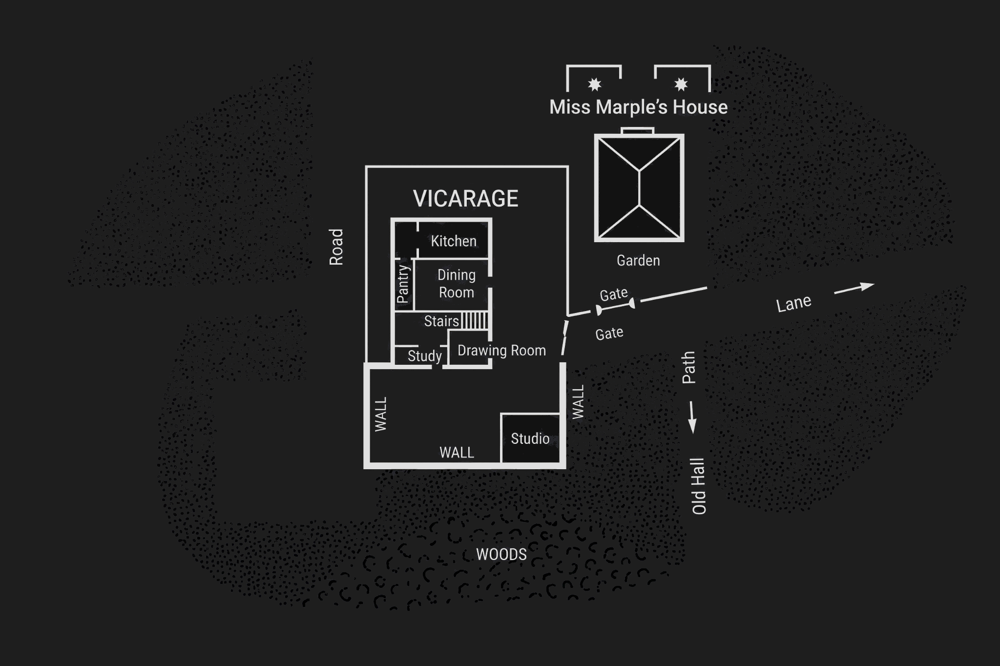

"Nasty old cat," said Griselda as soon as the door was closed. She made a face in the direction of the departing visitors and then looked at me and laughed.

"Len, do you really suspect me of having an affair with Lawrence Redding?"

"My dear, of course not."

"But you thought Miss Marple was hinting at it. And you rose to my defence simply beautifully. Like—like an angry tiger."

A momentary uneasiness assailed me. A clergyman of the Church of England ought never to put himself in the position of being described as an angry tiger. However, I trusted that Griselda exaggerated.

"I felt the occasion could not pass without a protest," I said. "But Griselda, I wish you would be a little more careful in what you say."

"Do you mean the cannibal story?" she asked. "Or the suggestion that Lawrence was painting me in the nude? If they only knew that he was painting me in a thick cloak with a very high fur collar—the sort of thing that you could go quite purely to see the Pope in—not a bit of sinful flesh showing anywhere! In fact, it's all marvellously pure. Lawrence never even attempts to make love to me—I can't think why."

"Surely, knowing that you're a married woman—"

"Don't pretend to come out of the Ark, Len. You know very well that an attractive woman with an elderly husband is a kind of gift from heaven to a young man. There must be some other reason—It's not that I'm unattractive—I'm not."

"Surely you don't want him to make love to you?"

"N-n-o," said Griselda with more hesitation than I thought becoming.

"If he's in love with Lettice Protheroe—"

"Miss Marple didn't seem to think he was."

"Miss Marple may be mistaken."

"She never is. That kind of old cat is always right." She paused a minute and then said, with a quick, sidelong glance at me, "You do believe me, don't you? I mean, that there's nothing between Lawrence and me."

"My dear Griselda," I said surprised. "Of course."

My wife came across and kissed me.

"I wish you weren't so terribly easy to deceive, Len. You'd believe me whatever I said."

"I should hope so. But, my dear, I do beg of you to guard your tongue and be careful what you say. These women are singularly deficient in humour, remember, and take everything seriously."

"What they need," said Griselda, "is a little immorality in their lives. Then they wouldn't be so busy looking for it in other people's."

On this she left the room, and, glancing at my watch, I hurried out to pay some visits that ought to have been made earlier in the day.

The Wednesday evening service was sparsely attended as usual, but when I came out through the Church, after disrobing in the Vestry, it was empty save for a woman who stood staring up at one of our windows. We have some rather fine old stained glass, and indeed the Church itself is well worth looking at. She turned at my footsteps, and I saw that it was Mrs Lestrange.

We both hesitated a moment and then I said:

"I hope you like our little church."

"I've been admiring the screen," she said.

Her voice was pleasant, low yet very distinct with a clearcut enunciation. She added:

"I'm so sorry to have missed your wife yesterday."

We talked a few minutes longer about the church. She was evidently a cultured woman who knew something of church history and architecture. We left the building together and walked down the road, since one way to the Vicarage led past her house. As we arrived at the gate, she said pleasantly:

"Come in, won't you? And tell me what you think of what I have done."

I accepted the invitation. Little Gates had formerly belonged to an Anglo-Indian Colonel, and I could not help feeling relieved by the disappearance of the brass tables and the Burmese idols. It was furnished now very simply but in exquisite taste. There was a sense of harmony and rest about it.

Yet I wondered more and more what had brought such a woman as Mrs Lestrange to St. Mary Mead. She was so very clearly a woman of the world that it seemed a strange taste to bury herself in a country village.

In the clear light of her drawing room I had an opportunity of observing her closely for the first time.

She was a very tall woman. Her hair was gold with a tinge of red in it. Her eyebrows and eyelashes were dark, whether by art or by nature I could not decide. If she was, as I thought, made up, it was done very artistically. There was something Sphinxlike about her face when it was in repose, and she had the most curious eyes I have ever seen—they were almost golden in shade.

Her clothes were perfect, and she had all the ease of manner of a well-bred woman, and yet there was something about her that was incongruous and baffling. You felt that she was a mystery. The word Griselda had used occurred to me—*sinister*. Absurd, of course, and yet—was it so absurd? The thought sprang unbidden into my mind:

"This woman would stick at nothing."

Our talk was on most normal lines—pictures, books, old churches. Yet somehow I got very strongly the impression that there was something else—something of quite a different nature that Mrs Lestrange wanted to say to me.

I caught her eyes on me once or twice, looking at me with a curious hesitancy, as though she were unable to make up her mind. She kept the talk, I noticed, strictly to impersonal subjects. She made no mention of a husband, or of friends or relations.

But all the time there was that strange, urgent appeal in her glance. It seemed to say, "Shall I tell you? I want to. Can't you help me?"

Yet in the end it died away—or perhaps it had all been my fancy. I had the feeling that I was being dismissed. I rose and took my leave. As I went out of the room, I glanced back and saw her staring after me with a puzzled, doubtful expression. On an impulse I came back.

"If there is anything I can do—"

She said doubtfully, "It's very kind of you—"

We were both silent. Then she said:

"I wish I knew. It's difficult. No, I don't think anyone can help me. But thank you for offering to do so."

That seemed final, so I went. But as I did so, I wondered. We are not used to mysteries in St. Mary Mead.

So much is this the case that as I emerged from the gate I was pounced upon. Miss Hartnell is very good at pouncing in a heavy and cumbrous way.

"*I* saw you!" she exclaimed with ponderous humour. "And I *was* so excited. Now you can tell us all about it."

"About what?"

"The mysterious lady! Is she a widow or has she a husband somewhere?"

"I really couldn't say. She didn't tell me."

"How very peculiar. One would think she would be certain to mention something casually. It almost looks, doesn't it, as though she had a reason for not speaking?"

"I really don't see that."

"Ah! but as dear Miss Marple says, you are so unworldly, dear Vicar. Tell me, has she known Dr Haydock long?"

"She didn't mention him, so I don't know."

"Really? But what did you talk about then?"

"Pictures, music, books," I said truthfully.

Miss Hartnell, whose only topics of conversation are the purely personal, looked suspicious and unbelieving. Taking advantage of a momentary hesitation on her part as to how to proceed next, I bade her good night and walked rapidly away.

I called in at a house farther down the village and returned to the Vicarage by the garden gate, passing, as I did so, the danger point of Miss Marple's garden. However, I did not see how it was humanly possible for the news of my visit to Mrs Lestrange to have yet reached her ears, so I felt reasonably safe.

As I latched the gate, it occurred to me that I would just step down to the shed in the garden which young Lawrence Redding was using as a studio, and see for myself how Griselda's portrait was progressing.

I append a rough sketch here which will be useful in the light of after happenings, only sketching in such details as are necessary.

I had no idea there was anyone in the studio. There had been no voices from within to warn me, and I suppose that my own footsteps made no noise upon the grass.

I opened the door and then stopped awkwardly on the threshold. For there were two people in the studio, and the man's arms were round the woman and he was kissing her passionately.

The two people were the artist, Lawrence Redding, and Mrs Protheroe.

I backed out precipitately and beat a retreat to my study. There I sat down in a chair, took out my pipe, and thought things over. The discovery had come as a great shock to me. Especially since my conversation with Lettice that afternoon, I had felt fairly certain that there was some kind of understanding growing up between her and the young man. Moreover, I was convinced that she herself thought so. I felt positive that she had no idea of the artist's feelings for her stepmother.

A nasty tangle. I paid a grudging tribute to Miss Marple. She had not been deceived, but had evidently suspected the true state of things with a fair amount of accuracy. I had entirely misread her meaning glance at Griselda.

I had never dreamed of considering Mrs Protheroe in the matter. There has always been rather a suggestion of Cæsar's wife about Mrs Protheroe—a quiet, self-contained woman whom one would not suspect of any great depths of feeling.

I had got to this point in my meditations when a tap on my study window roused me. I got up and went to it. Mrs Protheroe was standing outside. I opened the window and she came in, not waiting for an invitation on my part. She crossed the room in a breathless sort of way and dropped down on the sofa.

I had the feeling that I had never really seen her before. The quiet, self-contained woman that I knew had vanished. In her place was a quick-breathing, desperate creature. For the first time I realized that Anne Protheroe was beautiful.

She was a brown-haired woman with a pale face and very deep-set grey eyes. She was flushed now and her breast heaved. It was as though a statue had suddenly come to life. I blinked my eyes at the transformation.

"I thought it best to come," she said. "You—you saw just now?"

I bowed my head.

She said very quietly, "We love each other."

And even in the middle of her evident distress and agitation she could not keep a little smile from her lips. The smile of a woman who sees something very beautiful and wonderful.

I still said nothing, and she added presently:

"I suppose to you that seems very wrong?"

"Can you expect me to say anything else, Mrs Protheroe?"

"No—no; I suppose not."

I went on, trying to make my voice as gentle as possible:

"You are a married woman—"

She interrupted me.

"Oh! I know—I know. Do you think I haven't gone over all that again and again? I'm not a bad woman really—I'm not. And things aren't—aren't—as you might think they are."

I said gravely, "I'm glad of that."

She asked rather timorously:

"Are you going to tell my husband?"

I said rather drily:

"There seems to be a general idea that a clergyman is incapable of behaving like a gentleman. That is not true."

She threw me a grateful glance.

"I'm so unhappy. Oh! I'm so dreadfully unhappy. I can't go on. I simply can't go on. And I don't know what to do." Her voice rose with a slightly hysterical note in it. "You don't know what my life is like. I've been miserable with Lucius from the beginning. No woman could be happy with him. I wish he were dead. It's awful, but I do. I'm desperate. I tell you, I'm desperate."

She started and looked over at the window.

"What was that? I thought I heard someone? Perhaps it's Lawrence."

I went over to the window, which I had not closed, as I had thought. I stepped out and looked down the garden, but there was no one in sight. Yet I was almost convinced that I, too, had heard someone. Or perhaps it was her certainty that had convinced me.

When I re-entered the room she was leaning forward, drooping her head down. She looked the picture of despair. She said again:

"I don't know what to do. I don't know what to do."

I came and sat down beside her. I said the things I thought it was my duty to say, and tried to say them with the necessary conviction, uneasily conscious all the time that that same morning I had given voice to the sentiment that a world without Colonel Protheroe in it would be improved for the better.

Above all, I begged her to do nothing rash. To leave her home and her husband was a very serious step.

I don't suppose I convinced her. I have lived long enough in the world to know that arguing with anyone in love is next door to useless, but I do think my words brought to her some measure of comfort.

When she rose to go, she thanked me, and promised to think over what I had said.

Nevertheless, when she had gone, I felt very uneasy. I felt that hitherto I had misjudged Anne Protheroe's character. She impressed me now as a very desperate woman, the kind of woman who would stick at nothing, once her emotions were aroused. And she was desperately, wildly, madly in love with Lawrence Redding, a man several years younger than herself.

I didn't like it.
