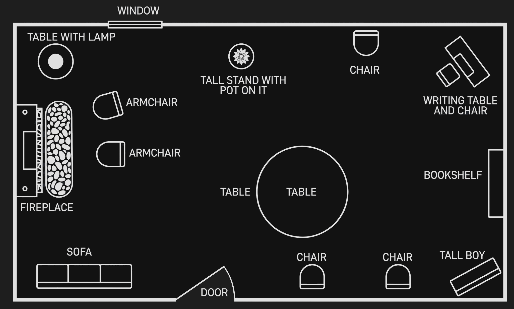

It was nearer seven than half past six when I approached the Vicarage gate on my return. Before I reached it, it swung open and Lawrence Redding came out. He stopped dead on seeing me and I was immediately struck by his appearance. He looked like a man who was on the point of going mad. His eyes stared in a peculiar manner; he was deathly white, and he was shaking and twitching all over.

I wondered for a moment whether he could have been drinking, but repudiated the idea immediately.

"Hullo," I said, "have you been to see me again? Sorry I was out. Come back now. I've got to see Protheroe about some accounts—but I daresay we shan't be long."

"Protheroe," he said. He began to laugh. "Protheroe? You're going to see Protheroe? Oh! you'll see Protheroe all right. Oh! my God—yes."

I stared. Instinctively I stretched out a hand towards him. He drew sharply aside.

"No," he almost cried out. "I've got to get away—to think. I've got to think. I must think."

He broke into a run and vanished rapidly down the road towards the village, leaving me staring after him, my first idea of drunkenness recurring.

Finally I shook my head, and went on to the Vicarage. The front door is always left open, but nevertheless I rang the bell. Mary came wiping her hands on her apron.

"So you're back at last," she observed.

"Is Colonel Protheroe here?" I asked.

"In the study. Been here since a quarter past six."

"And Mr Redding's been here?"

"Come a few minutes ago. Asked for you. I told him you'd be back any minute and that Colonel Protheroe was waiting in the study, and he said he'd wait too and went there. He's there now."

"No, he isn't," I said. "I've just met him going down the road."

"Well, I didn't hear him leave. He can't have stayed more than a couple of minutes. The mistress isn't back from town yet."

I nodded absent-mindedly. Mary beat a retreat to the kitchen quarters and I went down the passage and opened the study door.

After the dusk of the passage, the evening sunshine that was pouring into the room made my eyes blink. I took a step or two across the floor and then stopped dead.

For a moment I could hardly take in the meaning of the scene before me.

Colonel Protheroe was lying sprawled across my writing table in a horrible, unnatural position. There was a pool of some dark fluid on the desk by his head, and it was slowly dripping onto the floor with a horrible drip, drip, drip.

I pulled myself together and went across to him. His skin was cold to the touch. The hand that I raised fell back lifeless. The man was dead—shot through the head.

I went to the door and called Mary. When she came I ordered her to run as fast as she could and fetch Dr Haydock, who lives just at the corner of the road. I told her there had been an accident.

Then I went back and closed the door to await the doctor's coming.

Fortunately, Mary found him at home. Haydock is a good fellow, a big, fine, strapping fellow, with an honest, rugged face.

His eyebrows went up when I pointed silently across the room. But like a true doctor he showed no signs of emotion. He bent over the dead man, examining him rapidly. Then he straightened himself and looked across at me.

"Well?" I asked.

"He's dead right enough—been dead half an hour, I should say."

"Suicide?"

"Out of the question, man. Look at the position of the wound. Besides, if he shot himself, where's the weapon?"

True enough, there was no sign of any such thing.

"We'd better not mess around with anything," said Haydock. "I'd better ring up the police."

He picked up the receiver and spoke into it. He gave the facts as curtly as possible and then replaced the telephone and came across to where I was sitting.

"This is a rotten business. How did you come to find him?"

I explained.

"A rotten business," he repeated.

"Is—is it murder?" I asked rather faintly.

"Looks like it. Mean to say, what else can it be? Extraordinary business. Wonder who had a down on the poor old fellow. Of course I know he wasn't popular, but one isn't often murdered for that reason—worse luck."

"There's one rather curious thing," I said. "I was telephoned for this afternoon to go to a dying parishioner. When I got there everyone was very surprised to see me. The sick man was very much better than he had been for some days, and his wife flatly denied telephoning for me at all."

Haydock drew his brows together.

"That's suggestive—very. You were being got out of the way. Where's your wife?"

"Gone up to London for the day."

"And the maid?"

"In the kitchen—right at the other side of the house."

"Where she wouldn't be likely to hear anything that went on in here. It's a nasty business. Who knew that Protheroe was coming here this evening?"

"He referred to the fact this morning in the village street, at the top of his voice as usual."

"Meaning that the whole village knew it! Which they always do in any case. Know of anyone who had a grudge against him?"

The thought of Lawrence Redding's white face and staring eyes came to my mind. I was spared answering by a noise of shuffling feet in the passage outside.

"The police," said my friend, and rose to his feet.

Our police force was represented by Constable Hurst, looking very important but slightly worried.

"Good evening, gentlemen," he greeted us. "The Inspector will be here any minute. In the meantime I'll follow out his instructions. I understand Colonel Protheroe's been found shot—in the Vicarage."

He paused and directed a look of cold suspicion at me which I tried to meet with a suitable bearing of conscious innocence.

He moved over to the writing table and announced:

"Nothing to be touched till the Inspector comes."

For the convenience of my readers, I append a sketch plan of the room.

He got out his notebook, moistened his pencil and looked expectantly at both of us.

I repeated my story of discovering the body. When he had got it all down, which took some time, he turned to the doctor.

"In your opinion, Dr Haydock, what was the cause of death?"

"Shot through the head at close quarters."

"And the weapon?"

"I can't say with certainty until we get the bullet out. But I should say in all probability the bullet was fired from a pistol of small calibre—say a Mauser .25."

I started, remembering our conversation of the night before, and Lawrence Redding's admission. The police constable brought his cold fishlike eye round on me.

"Did you speak, sir?"

I shook my head. Whatever suspicions I might have, they were no more than suspicions, and as such to be kept to myself.

"When, in your opinion, did the tragedy occur?"

The doctor hesitated for a minute before he answered. Then he said:

"The man has been dead just over half an hour, I should say. Certainly not longer."

Hurst turned to me.

"Did the girl hear anything?"

"As far as I know she heard nothing," I said. "But you had better ask her."

But at this moment Inspector Slack arrived, having come by car from Much Benham, two miles away.

All that I can say of Inspector Slack is that never did a man more determinedly strive to contradict his name. He was a dark man, restless and energetic in manner, with black eyes that snapped ceaselessly. His manner was rude and overbearing in the extreme.

He acknowledged our greetings with a curt nod, seized his subordinate's notebook, perused it, exchanged a few curt words with him in an undertone, then strode over to the body.

"Everything's been messed up and pulled about, I suppose," he said.

"I've touched nothing," said Haydock.

"No more have I," I said.

The Inspector busied himself for some time peering at the things on the table and examining the pool of blood.

"Ah!" he said in a tone of triumph. "Here's what we want. Clock overturned when he fell forward. That'll give us the time of the crime. Twenty-two minutes past six. What time did you say death occurred, doctor?"

"I said about half an hour, but—"

The Inspector consulted his watch.

"Five minutes past seven. I got word about ten minutes ago, at five minutes to seven. Discovery of the body was at about a quarter to seven. I understand you were fetched immediately. Say you examined it at ten minutes to—Why, that brings it to the identical second almost!"

"I don't guarantee the time absolutely," said Haydock. "That is an approximate estimate."

"Good enough, sir, good enough."

I had been trying to get a word in.

"About that clock—"

"If you'll excuse me, sir, I'll ask you any questions I want to know. Time's short. What I want is absolute silence."

"Yes, but I'd like to tell you—"

"Absolute silence," said the Inspector, glaring at me ferociously.

I gave him what he asked for.

He was still peering about the writing table.

"What was he sitting here for," he grunted. "Did he want to write a note? Hullo—what's this?"

He held up a piece of note paper triumphantly. So pleased was he with his find that he permitted us to come to his side and examine it with him.

It was a piece of Vicarage note paper, and it was headed at the top 6.20.

Dear Clement (it began)

*Sorry I cannot wait any longer, but I must*.... Here the writing tailed off in a scrawl.

"Plain as a pike staff," said Inspector Slack triumphantly. "He sits down here to write this; an enemy comes softly in through the window and shoots him as he writes. What more do you want?"

"I'd just like to say—" I began.

"Out of the way, if you please, sir. I want to see if there are footprints."

He went down on his hands and knees, moving towards the open window.

"I think you ought to know—" I said obstinately.

The Inspector rose. He spoke without heat, but firmly:

"We'll go into all that later. I'd be obliged if you gentlemen will clear out of here. Right out, if you please."

We permitted ourselves to be shooed out like children.

Hours seemed to have passed—yet it was only a quarter past seven.

"Well," said Haydock. "That's that. When that conceited ass wants me, you can send him over to the surgery. So long."

"The mistress is back," said Mary, making a brief appearance from the kitchen. Her eyes were round and agog with excitement. "Come in about five minutes ago."

I found Griselda in the drawing room. She looked frightened, but excited.

I told her everything and she listened attentively.

"The letter is headed 6.20," I ended. "And the clock fell over and has stopped at 6.22."

"Yes," said Griselda. "But that clock, didn't you tell him that it was always kept a quarter of an hour fast?"

"No," I said. "I didn't. He wouldn't let me. I tried my best."

Griselda was frowning in a puzzled manner.

"But, Len," she said. "That makes the whole thing perfectly extraordinary. Because when that clock said twenty past six it was really five minutes past, and at five minutes past I don't suppose Colonel Protheroe had even arrived at the house."
