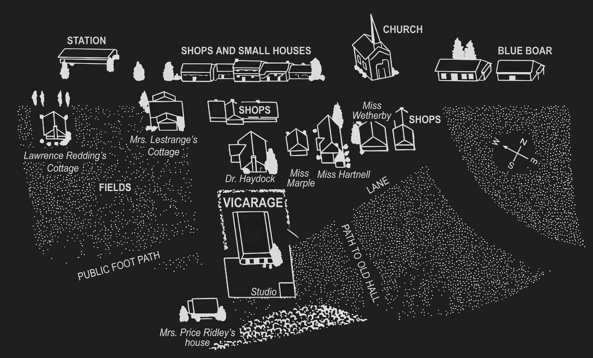

After leaving a message at the police station, the Chief Constable announced his intention of paying a visit to Miss Marple.

"You'd better come with me, Vicar," he said. "I don't want to give a member of your flock hysterics. So lend the weight of your soothing presence."

I smiled. For all her fragile appearance, Miss Marple is capable of holding her own with any policeman or chief constable in existence.

"What's she like?" asked the Colonel as we rang the bell. "Anything she says to be depended upon or otherwise?"

I considered the matter.

"I think she is quite dependable," I said cautiously. "That is, in so far as she is talking of what she has actually seen. Beyond that, of course, when you get on to what she thinks—well, that is another matter. She has a powerful imagination, and systematically thinks the worst of everyone."

"The typical elderly spinster, in fact," said Melchett with a laugh. "Well, I ought to know the breed by now. Gad, the tea parties down here!"

We were admitted by a very diminutive maid and shown into a small drawing room.

"A bit crowded," said Colonel Melchett, looking round. "But plenty of good stuff. A lady's room, eh, Clement?"

I agreed, and at that moment the door opened and Miss Marple made her appearance.

"Very sorry to bother you, Miss Marple," said the Colonel when I had introduced him, putting on his bluff, military manner, which he had an idea was attractive to elderly ladies. "Got to do my duty, you know."

"Of course, of course," said Miss Marple. "I quite understand. Won't you sit down? And might I offer you a little glass of cherry brandy? My own making. A recipe of my grandmother's."

"Thank you very much, Miss Marple. Very kind of you. But I think I won't. Nothing till lunch time, that's my motto. Now, I want to talk to you about this sad business—very sad business indeed. Upset us all, I'm sure. Well, it seems possible that, owing to the position of your house and garden, you may have been able to tell us something we want to know about yesterday evening."

"As a matter of fact, I was in my little garden from five o'clock onwards yesterday, and of course from there—well, one simply cannot help seeing anything that is going on next door."

"I understand, Miss Marple, that Mrs Protheroe passed this way yesterday evening?"

"Yes, she did. I called out to her, and she admired my roses."

"Could you tell us about what time that was?"

"I should say it was just a minute or two after a quarter past six. Yes, that's right. The church clock had just chimed the quarter."

"Very good. What happened next?"

"Well, Mrs Protheroe said she was calling for her husband at the Vicarage, so that they could go home together. She had come along the lane, you understand, and she went into the Vicarage by the back gate and across the garden."

"She came from the lane?"

"Yes, I'll show you."

Full of eagerness, Miss Marple led us out into the garden, and pointed out the lane that ran along by the bottom of her garden.

"The path opposite with the stile leads to the Hall," she explained. "That was the way they were going home together. Mrs Protheroe came from the village."

"Perfectly, perfectly," said Colonel Melchett. "And she went across to the Vicarage, you say?"

"Yes. I saw her turn the corner of the house. I suppose the Colonel wasn't there yet, because she came back almost immediately, and went down the lawn to the studio—that building there. The one the Vicar lets Mr Redding use as a studio."

"I see. And—you didn't happen to hear a shot, Miss Marple?"

"I didn't hear a shot then," said Miss Marple.

"But you did hear one some time?"

"Yes, I think there was a shot somewhere in the woods. But quite five or ten minutes afterwards—and, as I say, out in the woods. At least, I think so. It couldn't have been—surely it couldn't have been—"

She stopped, pale with excitement.

"Yes, yes, we'll come to all that presently," said Colonel Melchett. "Please go on with your story. Mrs Protheroe went down to the studio?"

"Yes, she went inside and waited. Presently Mr Redding came along the lane from the village. He came to the Vicarage gate, looked all round—"

"And saw you, Miss Marple."

"As a matter of fact, he didn't see me," said Miss Marple flushing slightly. "Because, you see, just at that minute I was bending right over—trying to get up one of those nasty dandelions, you know. So difficult. And then he went through the gate and down to the studio."

"He didn't go near the house?"

"Oh! no, he went straight to the studio. Mrs Protheroe came to the door to meet him, and then they both went inside."

Here Miss Marple contributed a singularly eloquent pause.

"Perhaps she was sitting to him?" I suggested.

"Perhaps," said Miss Marple.

"And they came out—when?"

"About ten minutes later."

"That was roughly?"

"The church clock had chimed the half hour. They strolled out through the garden gate and along the lane, and, just at that minute, Dr Stone came down the path leading to the Hall, and climbed over the stile and joined them. They all walked towards the village together. At the end of the lane, I think, but I can't be quite sure, they were joined by Miss Cram. I think it must have been Miss Cram, because her skirts were so short."

"You must have very good eyesight, Miss Marple, if you can observe as far as that."

"I was observing a bird," said Miss Marple. "A golden-crested wren, I think he was. A sweet little fellow. I had my glasses out, and that's how I happened to see Miss Cram (if it was Miss Cram, and I think so) join them."

"Ah! well, that may be so," said Colonel Melchett. "Now, since you seem very good at observing, did you happen to notice, Miss Marple, what sort of expression Mrs Protheroe and Mr Redding had as they passed along the lane?"

"They were smiling and talking," said Miss Marple. "They seemed very happy to be together, if you know what I mean."

"They didn't seem upset or disturbed in any way?"

"Oh! no. Just the opposite."

"Deuced odd," said the Colonel. "There's something deuced odd about the whole thing."

Miss Marple suddenly took our breath away by remarking in a placid voice:

"Has Mrs Protheroe been saying that she committed the crime now?"

"Upon my soul," said the Colonel. "How did you come to guess that, Miss Marple?"

"Well, I rather thought it might happen," said Miss Marple. "I think dear Lettice thought so too. She's really a very sharp girl. Not always very scrupulous, I'm afraid. So Anne Protheroe says she killed her husband. Well, well. I don't think it's true. No, I'm almost sure it isn't true. Not with a woman like Anne Protheroe. Although one never can be quite sure about anyone, can one? At least that's what I've found. When does she say she shot him?"

"At twenty minutes past six. Just after speaking to you."

Miss Marple shook her head slowly and pityingly. The pity was, I think, for two full grown men being so foolish as to believe such a story. At least that is what we felt like.

"What did she shoot him with?"

"A pistol."

"Where did she find it?"

"She brought it with her."

"Well, that she didn't do," said Miss Marple with unexpected decision. "I can swear to that. She'd no such thing with her."

"You mightn't have seen it."

"Of course I should have seen it."

"If it had been in her handbag."

"She wasn't carrying a handbag."

"Well, it might have been concealed—er—upon her person."

Miss Marple directed a glance of sorrow and scorn upon him.

"My dear Colonel Melchett. You know what young women are nowadays. Not ashamed to show exactly how the creator made them. She hadn't so much as a handkerchief in the top of her stocking."

Melchett was obstinate.

"You must admit that it all fits in," he said. "The time, the overturned clock pointing to 6.22—"

Miss Marple turned on me.

"Do you mean you haven't told him about that clock yet?"

"What about the clock, Clement?"

I told him. He showed a good deal of annoyance.

"Why on earth didn't you tell Slack this last night?"

"Because," I said, "he wouldn't let me."

"Nonsense, you ought to have insisted."

"Probably," I said, "Inspector Slack behaves quite differently to you than he does to me. I had no earthly chance of insisting."

"It's an extraordinary business altogether," said Melchett. "If a third person comes along and claims to have done this murder, I shall go into a lunatic asylum."

"If I might be allowed to suggest—" murmured Miss Marple.

"Well?"

"If you were to tell Mr Redding what Mrs Protheroe has done, and then explain that you don't really believe it is her; and then if you were to go to Mrs Protheroe and tell her that Mr Redding is all right—why then, they might each of them tell you the truth. And the truth *is* helpful, though I daresay they don't know very much themselves, poor things."

"It's all very well, but they are the only two people who had a motive for making away with Protheroe."

"Oh! I wouldn't say that, Colonel Melchett," said Miss Marple.

"Why, can you think of anyone else?"

"Oh! yes, indeed. Why," she counted on her fingers, "one, two, three, four, five, six—yes, and a possible seven. I can think of at least seven people who might be very glad to have Colonel Protheroe out of the way."

The Colonel looked at her feebly.

"Seven people? In St. Mary Mead?"

Miss Marple nodded brightly.

"Mind you, I name no names," she said. "That wouldn't be right. But I'm afraid there's a lot of wickedness in the world. A nice, honourable, upright soldier like you doesn't know about these things, Colonel Melchett."

I thought the Chief Constable was going to have apoplexy.
